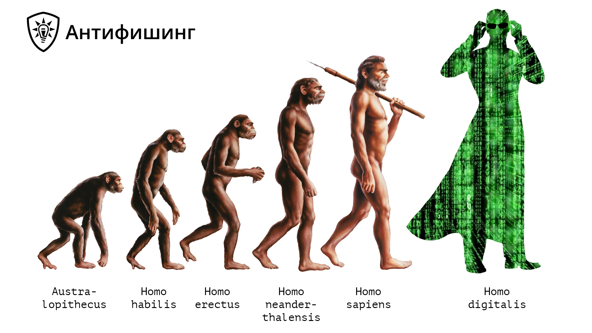

# README.md



# Концепция People as Code для управления защищенностью организации от угроз человеческого фактора

В концепции People as Code человек становится управляемым оцифрованным активом, с которым специалисты команд безопасности могут работать так же эффективно, как с другими цифровыми активами. 

Homo sapiens — обычные люди, сотрудники и подрядчики — зона высокой неопределенности и повышенного риска в процессах безопасности. К их знаниям, навыкам, мотивации и убеждениям не предъявляется конкретных требований, а их состояние в контексте рисков безопасности не оценивается и в 80% случаев приводит к инцидентам. 

Homo digitals ****— люди в концепции People as Code — оцифрованные супергерои, которые не совершают инцидентов, работают безопасно и эффективно.

Роли людей, их доступы и возможность влиять на недопустимые события идеально описывается структурами данных.

People CMDB — база данных управления конфигурациями сотрудников — репозиторий, который содержит информацию о ролях, свойствах сотрудников (знания, навыки, мотивация, убеждения), их уровнях защищенности и других параметрах согласно методологии Антифишинга. 

People CMDB также описывает ключевые цели бизнеса, недопустимые события, возможные сценарии их наступления, а также действия сотрудников, которые могут к ним привести и которые требуются, чтобы избежать инцидентов и обеспечить максимальную защищенность и киберустойчивость бизнеса. 

# Примеры структур People CMDB для реализации концепции People as Code

## **Бизнес-цели**

```json
[
    {
        "business goal": "Подрядчики получают оплату за свои услуги вовремя",
        "critical events": [
            1
        ]
    },    
    {
        "business goal": "Клиенты успешно работают с продуктивной системой",
        "critical events": [
            2
        ]
    }
]
```

## **Недопустимые события**

```json
[
    {
        "critical event": "Платежи остановлены, нарушены обязательства",
        "id": 1,
        "scenarios": [
            1
        ]
    },
    {
        "critical event": "Продуктивная система взломана и клиентские данные скомпрометированы",
        "id": 2,
        "scenarios": [
            2
        ]
    }
]
```

## **Сценарии наступления недопустимых событий**

```json
[
    {
        "scenario": "Сотрудник нажал на вложение с фишингом и словил шифровалищика - платежи нельзя отправлять",
        "scenario_id": 1,
        "roles": [
            "accountant",
            "senior accountant"
        ],
        "unsafe_actions": [
            3
        ],
        "safe_actions": [
            2,
            3
        ]
    },
    {
        "scenario": "В приложении на продуктивном кластере обнаружена публично известная уязвимость во внешней библиотеке",
        "scenario_id": 2,
        "roles": [
            "frontend developer",
            "lead frontend developer",
            "backend developer",
            "ios developer"
        ],
        "unsafe_actions": [
            1,
            2
        ],
        "safe_actions": [
            1,
            2
        ]
    }   
]
```

## **Опасные действия**

```json
[
    {
        "unsafe_action": "подключить уязвимую библиотеку из фрагмента кода со Stackoverflow",
        "action_id": 1
    },

    {
        "unsafe_action": "зафиксировать версию библиотеки два года назад и не обновлять ее",
        "action_id": 2
    },    

    {
        "unsafe_action": "открыть неизвестный файл из эл. почты",
        "action_id": 3
    }
 
]
```

## Правильные **действия**

```json
[
    {
        "safe_action": "проверить, могут ли уже подключенные библиотеки выполнить нужную функцию",
        "action_id": 1,
        "motivation": {
            "believes": [
                "внешние зависимости могут иметь уязвимости",
                "злоумышленники могут эксплуатировать уязвимости через зависимости",
                "не стоит подключать новые библиотеки, если уже подключенные могут решить задачу",
                "больше зависимостей дает больше проблем с поддержкой приложения"
            ]
        },
        "ability": {
            "knowledge": [
                "какие возможности дают уже подключенные библиотеки",
                "алгоритм принятия решения о подключении новой библиотеки",
                "как новые зависимости влияют на время сборки и размер бандла"
            ],
            "skills": [
                "поиск нужной функциональности в существующей кодовой базе"
            ],
            "means": [
                
            ]
        }
    },
        {
        "safe_action": "выбирать безопасные зависимости",
        "action_id": 2,
        "motivation": {
            "believes": [
                "известные мейнтейнеры делают более качественное ПО",
                "если библиотека активно развивается, то и проблемы, и уязвимости устранятся быстрее",
                "судить о качестве кода по количеству звезд на GitHub некорректно",
                "хорошая и подробная документация может говорить о высоком качестве библиотеки"
            ]
        },
        "ability": {
            "knowledge": [
                "алгоритм выбора качественной библиотеки",
                "обратная связь сообщества",
                "публично известные проблемы с качеством"
            ],
            "skills": [
                "отличить хорошего мейнтейнера от плохого",
                "применить алгоритм и выбрать качественную библиотеку",
                "проверять, есть ли в выбранной версии библиотеки известные уязвимости"
            ],
            "means": [
                "GitHub",
                "Stackoverflow"
            ]
        }
    },
    {
        "safe_action": "сообщить от атаке",
        "action_id": 3,
        "motivation": {
            "believes": [
                "информационные активы компании важны",
                "мошенники могут отправить мне вредоносный файл",
                "мошенники могут отправлять письма и сообщения от имени коллег"
            ]
        },
        "ability": {
            "knowledge": [
                "как проверить письма отправителя",
                "как устроена атака с фишинговым письмом",
                "какие бывают опасные файлы",
                "какие эмоции могут использовать мошенники",
                "признаки фишинга",
                "способы проверки файла на вирусы"
            ],
            "skills": [
                "проверять вложения на ПК",
                "проверять отправителя письма",
                "проверять письмо на признаки фишинга",
                "проверить легитимность запроса из письма"
            ],
            "means": [
                "Repoter plugin"
            ]
        }
    },
    {
        "safe_action": "удалить письмо",
        "action_id": 4
    } 
]
```

## Роли

```json
[
    {
        "role": "accountant",
        "safety level": 2,
        "motivation": "high"
    },
    {
        "role": "senior accountant",
        "safety level": 3,
        "motivation": "high"
    },
    {
        "role": "frontend developer",
        "safety level": 3,
        "motivation": "high"
    },
    {
        "role": "lead frontend developer",
        "safety level": 3,
        "motivation": "high"
    },
    {
        "role": "backend developer",
        "safety level": 3,
        "motivation": "high"
    },
    {
        "role": "ios developer",
        "safety level": 3,
        "motivation": "high"
    }
       
]
```

## Сотрудники

```json
[
    {
        "employee_id": 40201,
        "fullName": "Нина Ивановна Петрова",
        "email": "accountant@company.domain",
        "department": "Бухгалтерия",
        "roles": [
            "accountant"
        ],
        "safety level": 1,
        "priority": 1,
        "motivation": "medium"
    },
    {
        "employee_id": 9245,
        "fullName": "Алексей Алексеев",
        "email": "frontend@software.dev",
        "department": "Разработка ПО",
        "roles": [
            "frontend developer"
        ],
        "safety level": 1,
        "priority": 1,
        "motivation": "medium"
    }
]
```

## Курсы

```json
[
    {
        "course": "Безопасная работа с зависимостями в коде. Часть 1. Принцип минимально необходимого. Алгоритм выбора качественной библиотеки",
        "course_id": 1,
        "knowledge": [
                "какие возможности дают уже подключенные библиотеки",
                "алгоритм принятия решения о подключении новой библиотеки",
                "как новые зависимости влияют на время сборки и размер бандла",
                "алгоритм выбора качественной библиотеки",
                "обратная связь сообщества",
                "публично известные проблемы с качеством"
        ],
        "skills": [
                "поиск нужной функциональности в существующей кодовой базе",
                "отличить хорошего мейнтейнера от плохого",
                "применить алгоритм и выбрать качественную библиотеку",
                "проверять, есть ли в выбранной версии библиотеки известные уязвимости"
        ],
        "believes": [
                "внешние зависимости могут иметь уязвимости",
                "злоумышленники могут эксплуатировать уязвимости через зависимости",
                "не стоит подключать новые библиотеки, если уже подключенные могут решить задачу",
                "больше зависимостей дает больше проблем с поддержкой приложения",
                "известные мейнтейнеры делают более качественное ПО",
                "если библиотека активно развивается, то и проблемы, и уязвимости устранятся быстрее",
                "судить о качестве кода по количеству звезд на GitHub некорректно",
                "хорошая и подробная документация может говорить о высоком качестве библиотеки"
        ]
    },
    {
        "course": "Безопасная работа с электронной почтой",
        "course_id": 2,
        "knowledge": [
            "как проверить письма отправителя",
            "как устроена атака с фишинговым письмом",
            "какие бывают опасные файлы",
            "какие эмоции могут использовать мошенники",
            "признаки фишинга",
            "способы проверки файла на вирусы"
        ],
        "believes": [
            "информационные активы компании важны"
        ]
    }
]
```

## Имитированные атаки

```json
[
    {
        "attack": "Имитированная атака от контрагента с вложением",
        "skills": [
            "проверять вложения на ПК",
            "проверять отправителя письма",
            "проверять письмо на признаки фишинга",
            "проверить легитимность запроса из письма"
        ],
        "believes": [
            "мошенники могут отправить мне вредоносный файл",
            "мошенники могут отправлять письма и сообщения от имени коллег"
        ]
    }
]
```

# Примеры на специфичном DSL-языке для интеграции People CMDB со средствами защиты и реализации концепции People as Code в ключевых процессах управления безопасностью

Мы описали несколько выражений на специфичном DSL-языке, который позволяет работать с людьми в концепции People as Code, полностью управлять процессом и конфигурациями и обеспечивать интеграцию сотрудников как оцифрованных активов с другими процессами и средствами обеспечения безопасности.

Подобный язык может быть использован в любых продуктах, которые поддерживают нашу методологию, помогают управлять состоянием сотрудников и обеспечивают защищенность организации. 

## Точка входа

```json
Define:
    Сотрудники
        roles + safety_level + priority + motivation

    Роли
        safety_level + motivation
    
    Бизнес-цели
        Недопустимые события
            Сценарии НС
                Опасные действия
                Безопасные действия
                    motivation
                        believes
                    Возможности
                        (knowledge + skills) х means

    Курсы + Имитированные атаки
        believes + knowledge + skills

Integrate:
    IDM
    IRP
    DevSecOps
```

## Интеграция с IDM

```json
IDM:
    для всех запросов на доступ
        проверять уровень защищенности сотрудника на соответствие требованиям роли
            если урвоень защищенности соответствует выдавать доступ
        иначе 
            повысить защищенность
                отправить на обучение
                    со сроком прохождения 5 дней
                отправить имитированную атаку
                    по сценарию в соответствии с требованиями роли
            каждый 1 час
                проверять уровень защищенности 
                если уровень защищенности соответствует выдать доступ
    для всех выданных доступов
        проверять уровень защищенности 
            каждый 1 час
        если уровень защищенности не соответствует требованиям роли
            закрыть доступ
            отправить уведомление
            повысить защищенность
        каждый 1 час
            проверять уровень защищенности 
            если уровень защищенности соответствует выдать доступ
```

## Интеграция с Service Desk

```json
SD:
    для всех бизнес-целей
        проверить means в соответствии с безопасными действиями
        отправить запросы на means в IDM
```

## Интеграция с IRP/SOC

```json
IRP:
    для всех инцидентов
        проверять уровень защищенности сотрудника на соответствие требованиям роли
            если не соответствует 
                повысить защищенность
                    отправить на обучение
                        по темам в соответствии с инцидентом
                        со сроком прохождения 5 дней
                    отправить имитированную атаку
                        по сценарию в соответствии с инцидентом
        проверять мотивацию на соответствие требованиям роли
            если не соответствует
                повысить мотивацию
                    провести видео-встречу с конструктивным разбором инцидента 
                    объяснить правильный, безопасный подход к работе
    для всех подозрений на инцидент
        проверять уровень защищенности сотрудника 
        определить приоритет реагирования по уровню защищенности сотрудника
```

## Интеграция с DevSecOps

```json
DevSecOps:
    для всех результатов прохождения Quality Gate
        получить отчет
        разобрать обнаружения по типам уязвимостей
        выбрать сотрудников с safety_level и motivation в соответствии с ролью
            выбрать сотрудников с ability по типам уязвимостей
        выбранным сотрудникам
            поручить триаж 
            выдать права на bypass   
    для всех pull request
        проверить safety_level и motivation сотрудника на соответствие роли
            если не соответствуют
                добавить особый комментарий в pull request                
                не одобрять pull request
                не выполнять merge
                повысить защищенность
                повысить мотивацию
        проверить ability сотрудника по требованиям проекта
            если не соответствуют
                добавить особый комментарий в pull request
                повысить ability по конкретным требованиям для выполнения безопасных действий
```